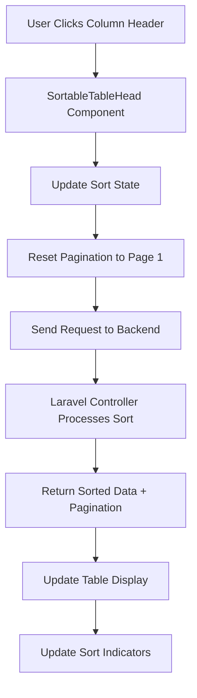

# Design Document: Table Sorting System

## Overview

This design implements a comprehensive table sorting system that enhances all existing tables in the Laravel + React (Inertia.js) application with toggleable column headers, consistent sorting behavior, and responsive pagination. The system builds upon the existing UI components and patterns while introducing standardized sorting functionality across all data tables.

The solution leverages the current tech stack:
- **Frontend**: React 19 with TypeScript, Inertia.js for SPA behavior
- **UI Components**: Radix UI primitives with custom table components
- **Styling**: Tailwind CSS with responsive design patterns
- **Icons**: Lucide React for sort indicators
- **Backend**: Laravel with server-side pagination and sorting

## Architecture

### Component Hierarchy

```
SortableTable (New Enhanced Component)
├── TableHeader (Enhanced)
│   └── SortableTableHead (New Component)
│       ├── Column Content
│       └── Sort Indicators
├── TableBody (Existing)
│   └── TableRow (Existing)
│       └── TableCell (Existing)
└── PaginationControls (Enhanced Existing)
```

### Data Flow



## Components and Interfaces

### 1. Enhanced Table Components

#### SortableTable Component
```typescript
interface SortableTableProps {
  data: any[];
  columns: ColumnDefinition[];
  sortable?: boolean;
  pagination?: PaginationData;
  onSort?: (column: string, direction: 'asc' | 'desc' | null) => void;
  onPageChange?: (page: number) => void;
  loading?: boolean;
  className?: string;
}

interface ColumnDefinition {
  key: string;
  label: string;
  sortable?: boolean;
  render?: (value: any, row: any) => React.ReactNode;
  className?: string;
}
```

#### SortableTableHead Component
```typescript
interface SortableTableHeadProps {
  column: ColumnDefinition;
  currentSort?: {
    column: string;
    direction: 'asc' | 'desc' | null;
  };
  onSort: (column: string) => void;
  className?: string;
}
```

### 2. Sort State Management

#### Sort Hook
```typescript
interface UseSortReturn {
  sortState: SortState;
  handleSort: (column: string) => void;
  getSortDirection: (column: string) => 'asc' | 'desc' | null;
  resetSort: () => void;
}

interface SortState {
  column: string | null;
  direction: 'asc' | 'desc' | null;
}
```

### 3. Enhanced Pagination Integration

#### Updated PaginationData Interface
```typescript
interface PaginationData {
  current_page: number;
  last_page: number;
  per_page: number;
  total: number;
  from: number;
  to: number;
  sort_by?: string;
  sort_order?: 'asc' | 'desc';
}
```

## Data Models

### Frontend State Models

#### TableState
```typescript
interface TableState {
  data: any[];
  pagination: PaginationData;
  sort: SortState;
  loading: boolean;
  error: string | null;
}
```

#### TableFilters (Extended)
```typescript
interface TableFilters {
  search?: string;
  sort_by?: string;
  sort_order?: 'asc' | 'desc';
  page?: number;
  per_page?: number;
  [key: string]: any; // Additional filters
}
```

### Backend Response Models

#### SortedPaginatedResponse
```typescript
interface SortedPaginatedResponse<T> {
  data: T[];
  current_page: number;
  last_page: number;
  per_page: number;
  total: number;
  from: number;
  to: number;
  sort_by: string | null;
  sort_order: 'asc' | 'desc' | null;
  links: PaginationLink[];
}
```

## Error Handling

### Client-Side Error Handling

1. **Sort Request Failures**
   - Display toast notification with error message
   - Revert to previous sort state
   - Provide retry mechanism

2. **Invalid Sort Parameters**
   - Validate column names against allowed sortable columns
   - Fallback to default sorting if invalid parameters provided

3. **Network Connectivity Issues**
   - Show loading states during requests
   - Implement request timeout handling
   - Provide offline state indicators

### Server-Side Error Handling

1. **Invalid Sort Columns**
   - Validate against model's sortable attributes
   - Return 400 Bad Request with descriptive error
   - Log security attempts for invalid column access

2. **Database Query Errors**
   - Catch SQL exceptions during sorting
   - Return fallback unsorted data with error flag
   - Log errors for monitoring

## Testing Strategy

### Unit Tests

1. **Component Testing**
   - SortableTableHead click interactions
   - Sort indicator rendering states
   - Responsive behavior across breakpoints

2. **Hook Testing**
   - useSort state transitions
   - Sort direction cycling logic
   - State reset functionality

3. **Utility Testing**
   - Sort parameter validation
   - URL parameter serialization
   - Data type sorting logic

### Integration Tests

1. **Table Sorting Flow**
   - End-to-end sort request cycle
   - Pagination reset on sort change
   - Multiple column sorting scenarios

2. **Responsive Behavior**
   - Mobile touch interactions
   - Tablet landscape/portrait modes
   - Desktop hover states

3. **Performance Testing**
   - Large dataset sorting (1000+ rows)
   - Rapid sort changes
   - Memory usage during operations

### Accessibility Testing

1. **Keyboard Navigation**
   - Tab order through sortable headers
   - Enter/Space key activation
   - Screen reader announcements

2. **ARIA Compliance**
   - Proper role attributes
   - Sort state announcements
   - Loading state communication

## Implementation Phases

### Phase 1: Core Infrastructure
- Create base SortableTable component
- Implement useSort hook
- Enhance existing table components

### Phase 2: Backend Integration
- Update Laravel controllers for sorting
- Implement server-side sort validation
- Enhance pagination responses

### Phase 3: UI Enhancement
- Add sort indicators and animations
- Implement responsive behaviors
- Apply consistent styling

### Phase 4: System Integration
- Replace existing table implementations
- Update all table usage across the application
- Implement error handling and loading states

### Phase 5: Testing and Optimization
- Comprehensive testing suite
- Performance optimization
- Accessibility compliance verification

## Responsive Design Considerations

### Mobile (< 768px)
- Minimum 44px touch targets for headers
- Simplified sort indicators
- Horizontal scroll for wide tables
- Stacked pagination controls

### Tablet (768px - 1024px)
- Balanced header spacing
- Medium-sized sort indicators
- Flexible pagination layout

### Desktop (> 1024px)
- Full-featured sort indicators
- Hover states and animations
- Inline pagination controls
- Keyboard shortcuts support

## Performance Considerations

### Client-Side Optimizations
- Debounced sort requests (300ms)
- Memoized column definitions
- Virtual scrolling for large datasets
- Lazy loading of non-visible data

### Server-Side Optimizations
- Database index optimization for sortable columns
- Query result caching
- Efficient pagination queries
- Rate limiting for sort requests

## Security Considerations

### Input Validation
- Whitelist allowed sort columns
- Sanitize sort direction parameters
- Validate pagination bounds

### Access Control
- Respect existing permission systems
- Column-level sort permissions
- Audit logging for sort operations

This design provides a comprehensive foundation for implementing consistent, responsive, and performant table sorting across the entire application while maintaining compatibility with existing code patterns and user expectations.